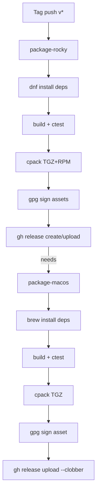

# Contributing

Changes should keep the project small, portable, and package-manager friendly. clambback targets **Rocky Linux** and **macOS** only; do not add Windows-, Android-, or other-distro-specific code or packaging.

Before submitting changes, build with CMake and run the smoke tests where the required local tools are available.

## Release Pipeline

Tagged pushes (`v*`) trigger `.github/workflows/release.yml`, which builds, signs, and publishes packages for both supported platforms. The Rocky Linux job runs first (inside a `rockylinux:9` container) and creates the GitHub Release; the macOS job waits for it (`needs: package-rocky`) and only uploads its own signed asset, avoiding a race to create the release.

